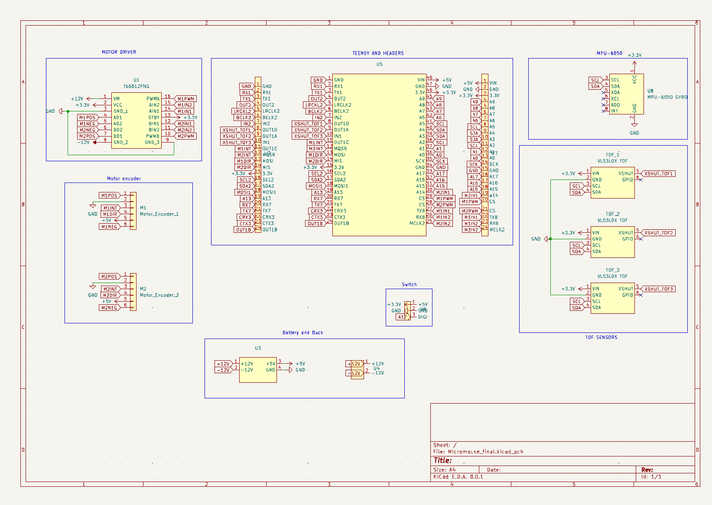
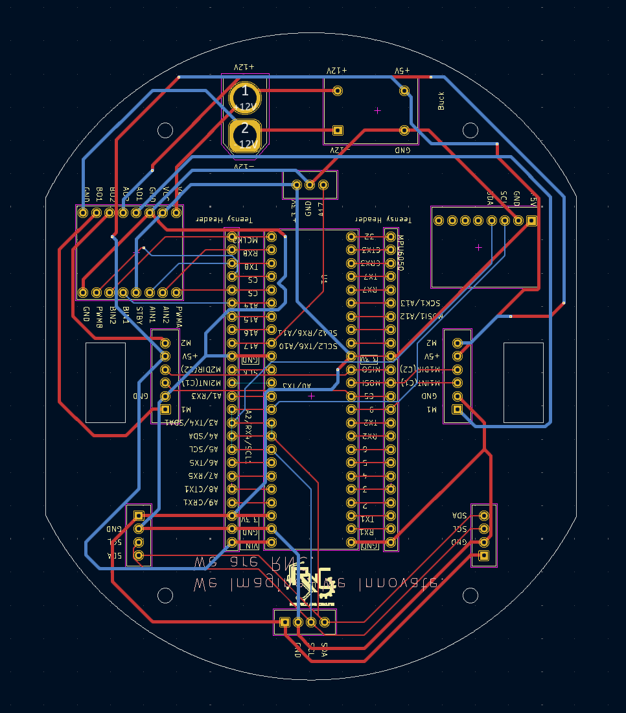

# MicroMouse: Autonomous Maze-Solving Robot

An autonomous, self-navigating maze-solving robot designed to map, compute, and solve a grid using the Flood Fill algorithm. The system features a custom-designed PCB to streamline power and sensing, coupled with real-time sensor feedback over standard serial protocols.  

## Tech Stack & Hardware Components
- Microcontroller: STM32F411CEU6 "Black Pill" (ARM Cortex-M4)
- Core Algorithm: Flood Fill (Maze mapping, cell weight updates, and path optimization)
- Sensing & Telemetry: 
  - VL53L0X Time-of-Flight (ToF) sensors for precise distance/wall detection
  - MPU6050 Gyroscope/Accelerometer for straight-line stabilization and precise turns
- Actuation & Control: 
  - 12V 1000RPM N20 Encoder Motors for closed-loop speed control
  - TB6612FNG Dual Motor Driver
- Power Management: 11.1V LiPo battery pack with onboard regulation for logic and motor rails
- Design Tools: KiCad (Schematics & PCB Layout)

## Firmware & Logic Implementation
- Maze Solving: Implements a dynamic Flood Fill matrix routine that updates cell values on the fly as the mouse discovers walls.
- Hardware Integration: Configured SPI/I2C buses to communicate with peripheral sensors and motor drivers, ensuring low-latency feedback loops for precise alignment.

## Hardware Architecture & PCB Design
To minimize structural footprint and eliminate complex wiring failure points, a custom multi-layer PCB was fabricated.
- Power Management: Dedicated onboard regulation filtering out 12V motor noise from the sensitive 3.3V STM32 logic lines.
- Sensor Alignment: Precise angled placement for the VL53L0X ToF sensors to map front and side clearances accurately.

## Maze Description
The robot was tested and validated in a physical maze environment configured with the following specifications:
- Dimensions and Grid: A modular grid layout featuring distinct pathways, vertical wall dividers, and an enclosed central target zone.
- Physical Construction: Built using white foam board panels for the structural walls and a gridded base layer featuring blue alignment markings to delineate cell thresholds.
- Core Objective: The robot starts from the outer perimeter and relies on real-time sensory feedback to dynamically map cell paths, track orientation changes, and navigate toward the centralized goal area.

- 

## Algorithm & Firmware Implementation

The robot utilizes a dynamic Flood Fill algorithm optimized for real-time maze-mapping, tracking orientation updates, path optimization, and execute routines.

### 1. Maze Initialization (Flood Fill Array)
- **Manhattan Distance Matrix:** At startup, the `initFloodfill` routine populates the `arena_map` grid using Manhattan distance bounds calculated relative to the target cell coordinate `(0, length - 1)`. Every cell is given an initial cost matrix weight indicating its theoretical steps away from the destination.
- **Perimeter Boundary Flagging:** The `initWalls` function instantiates the initial maze boundary configuration, defaulting the grid's outer boundary elements to closed parameters.

### 2. Sensor Polling & Real-Time Mapping
- **Dynamic Wall Updating:** During runtime execution loop, the robot polls data from the left, right, and center VL53L0X Time-of-Flight (ToF) sensors. If an obstacle distance drops below `detectDist` (180 mm), the corresponding coordinate index within the global `wall_data` matrix is permanently flagged (`= 1`).
- **Orientation-Aware Bitmasking:** The code tracks the absolute heading (`facing` variable mapping to 0: West, 1: North, 2: East, 3: South). Relative ToF configurations (Left, Front, Right) are translated into absolute compass coordinates to ensure accurate wall updates as the orientation shifts.

### 3. Queue-Driven Map Restructuring (`rearrange_map`)
- **Dead-End Discovery:** If the robot discovers new walls that make its current cell value equal to or lower than all accessible adjacent neighbors, the `rearrange_map` routine initiates.
- **BFS Flood Refresh:** The cell coordinate is pushed onto a custom `Queue` structure. The program continuously pops elements from the queue, calculating the minimum accessible neighbor via `minimum_value_accessible_neighbors`. The cell value is updated dynamically to `smallest_neighbor_value + 1`, and all unblocked adjacent neighbors are placed into the queue to recursively refresh the local routing map.

### 4. Navigation & Path Optimization
- **Compass to Action Translation:** The system determines optimal cell transitions through the `direction_wrt_bot` routine. It converts required compass steps into actual motion commands (`moveForward`, `TurnLeft`, `TurnRight`, `Turn180`).
- **Stack-Based Path Reduction:** As the mouse explores the maze, it tracks steps sequentially inside `path_taken`. Dead ends or backtracks are parsed by `reduceDirections`, which processes the path string through a custom stack interface to discard inverse direction pairings (e.g., North-South or East-West cancellations). This converts the discovery track into a clean tracking coordinate sequence saved into `short_path`.

### 5. Acceleration-Optimized Final Run (`final_run`)
- After mapping out the optimal trajectory, the system executes a localized final straightaway acceleration routine via `final_run`. 
- Instead of stopping at every single node intersection, the algorithm aggregates sequential straight moves (`steps++`). If sequential cells follow a uniform direction, it executes long-distance acceleration (`moveForward(steps * steplength * 0.9)`) coupled with tuned PD constants (`KP_WALL`, `KD_WALL`, `KP_YAW`), leveraging the N20 encoders for high-speed transit.

## Hardware Design & PCB Layout

### Schematic Capture

### PCB Layout & Routing

> **Note on Hardware Evolution:** This custom multi-layer PCB was originally architected and routed around a Teensy 4.1 MCU footprint. The subsequent physical implementation and final firmware integration were ported to the STM32F411CEU6 "Black Pill" microcontroller to align with specific processing, layout, and peripheral subsystem constraints.
