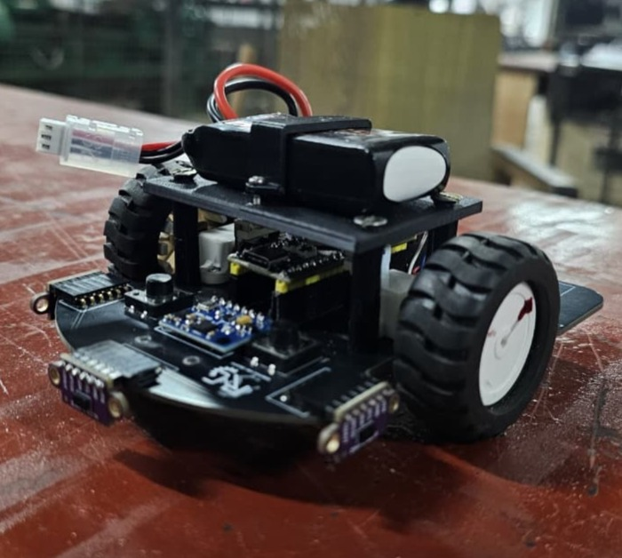
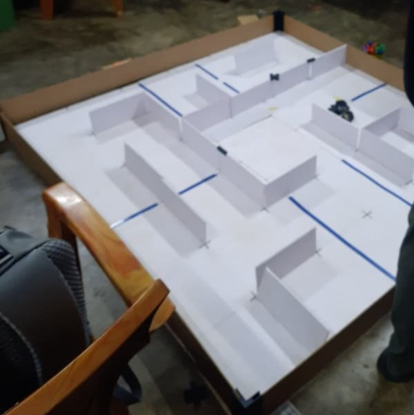

# MicroMouse: Autonomous Maze-Solving Robot

An autonomous, self-navigating maze-solving robot designed to map, compute, and solve a grid using the Flood Fill algorithm. The system features a custom-designed PCB to streamline power and sensing, coupled with real-time sensor feedback over standard serial protocols.

## Tech Stack & Hardware Components
- Microcontroller: STM32F411CEU6 "Black Pill" (ARM Cortex-M4)
- Core Algorithm: Flood Fill (Maze mapping, cell weight updates, and path optimization)
- Sensing & Telemetry: 
  - VL53L0X Time-of-Flight (ToF) sensors for precise distance/wall detection
  - MPU6050 Gyroscope/Accelerometer for straight-line stabilization and precise turns
- Actuation & Control: 
  - 12V 1000RPM N20 Encoder Motors for closed-loop speed control
  - TB6612FNG Dual Motor Driver
- Power Management: 11.1V LiPo battery pack with onboard regulation for logic and motor rails
- Design Tools: KiCad (Schematics & PCB Layout)

## Firmware & Logic Implementation
- Maze Solving: Implements a dynamic Flood Fill matrix routine that updates cell values on the fly as the mouse discovers walls.
- Hardware Integration: Configured SPI/I2C buses to communicate with peripheral sensors and motor drivers, ensuring low-latency feedback loops for precise alignment.

## Hardware Architecture & PCB Design
To minimize structural footprint and eliminate complex wiring failure points, a custom multi-layer PCB was fabricated.
- Power Management: Dedicated onboard regulation filtering out 12V motor noise from the sensitive 3.3V STM32 logic lines.
- Sensor Alignment: Precise angled placement for the VL53L0X ToF sensors to map front and side clearances accurately.

  

## Maze Description
The robot was tested and validated in a physical maze environment configured with the following specifications:
- Dimensions and Grid: A modular grid layout featuring distinct pathways, vertical wall dividers, and an enclosed central target zone.
- Physical Construction: Built using white foam board panels for the structural walls and a gridded base layer featuring blue alignment markings to delineate cell thresholds.
- Core Objective: The robot starts from the outer perimeter and relies on real-time sensory feedback to dynamically map cell paths, track orientation changes, and navigate toward the centralized goal area.

- 
